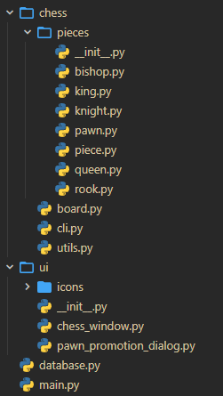
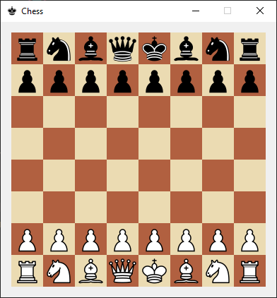
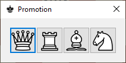
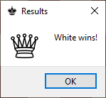

<!-- _footer: 2023 Сёмин В. -->

# ♟ Шахматы

##### Проект на Python с использованием Qt

---

# Введение

Цель проекта: Создать приложение, использующее функционал библиотек `PyQt` и `SQLite3`.

В качестве приложения была выбрана игра _"шахматы"_.

---

  
  <ul>
  <h2>Архитектура</h2>
    Приложение состоит из 3 модулей:
    

      <li>Chess</li>
      <li>UI</li>
      <li>Database</li>
    

  </ul>
  

---

## Chess

Содержит определение класса `Board` доски, а также дополнительный модуль `Pieces` с определением классов всех фигур.

---

## Chess

Класс `Board` является основным интерфейсом взаимодействия с игровым полем и содержит
все его свойства (положение фигур, очередь хода, состояния шаха и мата)

---

## Chess

|        Метод        |        Функционал        |
| :-----------------: | :----------------------: |
|   `move_piece()`    |    Перемещение фигуры    |
|    `get_piece()`    |  Прямой доступ к фигуре  |
|  `field_to_text()`  | Дамп поля для сохранения |
| `field_from_text()` |      Загрузка поля       |

---

<!-- header: Chess -->

## Pieces

Классы фигур содержат методы проверки на правильность хода.

Их экземпляры содержат собственный цвет и количество совершенных ходов.

---

<!-- header: "" -->

## UI

| Для создания интерфейса использовалась библиотека PyQt. Внешний вид приложения: |  |
| ---------------------------------------------------------------------------------- | ----------------------------------- |

---

<!-- header: UI -->
<!-- _footer: Интерфейс -->

---

При достижении пешкой противоположного края доски появляется диалоговое окно:

---

При завершении игры появляется диалог с результатом:

---

<!-- header: "" -->

## Database

Содержит класс для удобного взаимодействия с базой данных, которая в свою очередь
хранит список ходов в следующем формате:

| id  | field (STRING) | turn (STRING) |
| --- | -------------- | ------------- |
| 1   | pW,\_,bK...    | w             |
| 2   | \_,\_,bK...    | b             |

---

<!-- header: "" -->

## Database

Также класс способен записывать победителей в таблицу лидеров

---

https://github.com/virashu/pychessqt

---

## Спасибо за внимание!

## Прошу задавать вопросы
